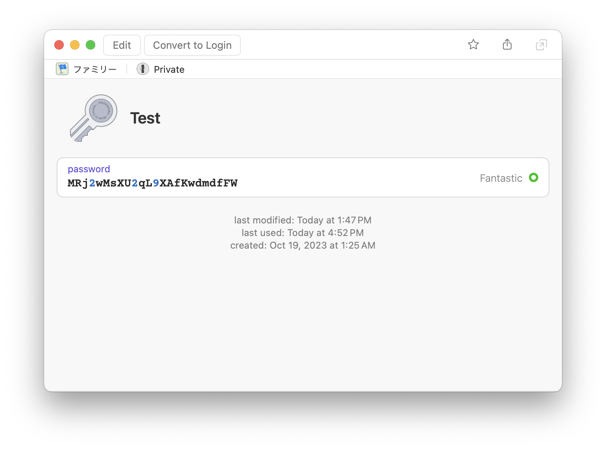

# op-sync

sync secrets from 1Password.

## Synopsis

`op-sync` requires [1Password CLI](https://developer.1password.com/docs/cli).

Here is a password in the item "Test" in the vault "Private".



Write the syncing configure in `.op-sync.yml`:

```yaml
# .op-sync.yml
secrets:
  MyPassword:
    type: template
    output: .envrc
    template: |
      MY_PASSWORD={{ op://Private/Test/password }}
```

Then, run `op-sync`:

```
$ eval $(op signin)
Enter the password for shogo82148@gmail.com at my.1password.com:
$ op-sync
2023/10/21 16:58:32 INFO 1password user information url=https://my.1password.com email=shogo82148@gmail.com
The following changes will be applied:
file ".envrc" will be created
Do you want to continue? (y/n) [n]: y
```

You will get `.envrc` injected the password.

```plain
MY_PASSWORD=MRj2wMsXU2qL9XAfKwdmdfFW
```

It is just same as running `echo "MY_PASSWORD={{ op://Private/Test/password }}" | op inject -o .envrc`.
However `op-sync` can work more services.

## Works with Other Services

### GitHub secrets

The following examples require installing [GitHub CLI](https://cli.github.com/).

GitHub Actions' secrets:

```yaml
secrets:
  MyPassword:
    type: github
    repository: shogo82148/op-sync
    name: MY_PASSWORD
    source: op://Private/Test/password
```

Environment's secrets:

```yaml
secrets:
  MyPassword:
    type: github
    repository: shogo82148/op-sync
    environment: production
    name: MY_PASSWORD
    source: op://Private/Test/password
```

Working with dependabot:

```yaml
secrets:
  MyPassword:
    type: github
    repository: shogo82148/op-sync
    application: dependabot
    name: MY_PASSWORD
    source: op://Private/Test/password
```

Organization's secrets:

```yaml
secrets:
  MyPassword:
    type: github
    organization: my-org
    name: MY_PASSWORD
    source: op://Private/Test/password
```

### AWS System Manager Parameter Store

```yaml
secrets:
  MyPassword:
    type: aws-ssm
    account: "123456789012"
    region: ap-northeast-1
    name: /path/to/secret
    source: op://Private/Test/password
```

### AWS Secrets Manager

```yaml
secrets:
  MyPassword:
    type: aws-secrets-manager
    account: "123456789012"
    region: ap-northeast-1
    name: password
    template:
      username: admin
      password: "{{ op://Private/Test/password }}"
```
